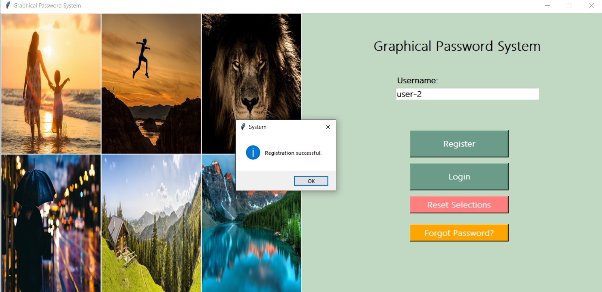
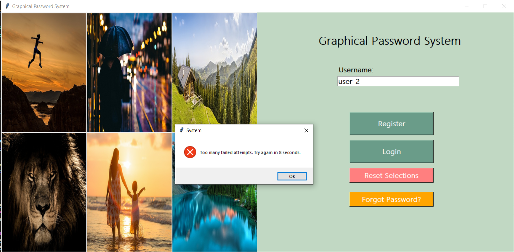
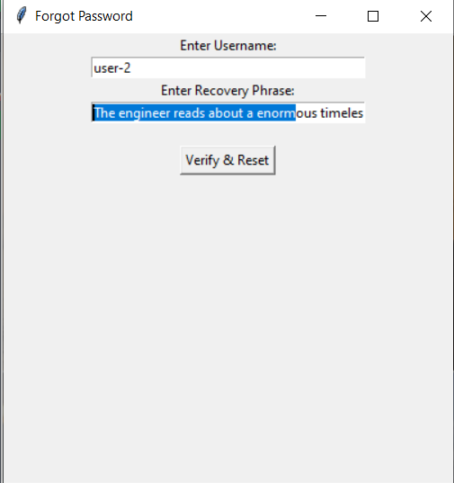

# Graphical Password Authentication System
# Project Description 
 The Graphical Password Authentication (GPA) System is a secure authentication mechanism that replaces traditional text-based passwords with an image-based approach. 
# ⚙️ Technical Details
 Languages Used : Python

Frameworks Used : Tkinter , Flask 

Libraries Used : Flask , bcrypt , Pillow (PIL) , mysql-connector-python , hashlib 

Tools Used: MySQL , JWT Authentication

# 🚀 Implementation 
## 🔸Backend (Flask API)
 * The Flask server (server.py) handles all authentication requests.

 * It interacts with the MySQL database to store and validate user credentials.

 * Uses bcrypt to hash and verify passwords securely.

 * Implements JWT-based authentication to manage user sessions securely.

## 🔸Frontend (Tkinter GUI)

 * Built using Tkinter for a simple and interactive desktop application.

 * The user selects images and grid points through a graphical interface.

 * Sends authentication data securely to the backend for verification.

## 🔸Database Structure

 * Users Table: Stores username, hashed password, and recovery word hash.

 * Images Table: Stores the selected images and their respective grid points.

 * Failed Attempts Log: Tracks login attempts to enforce cooldown and account blocking.

# 📷 Screenshots 

  
Registration Window 

  
Image Selection 

  
Selecting Points 

  
Recovery Phrase 

  
Successful Login

  
Failed Login 

  
Login Timeout  

  
User Permanently Ban 

  
 Forgot Password

